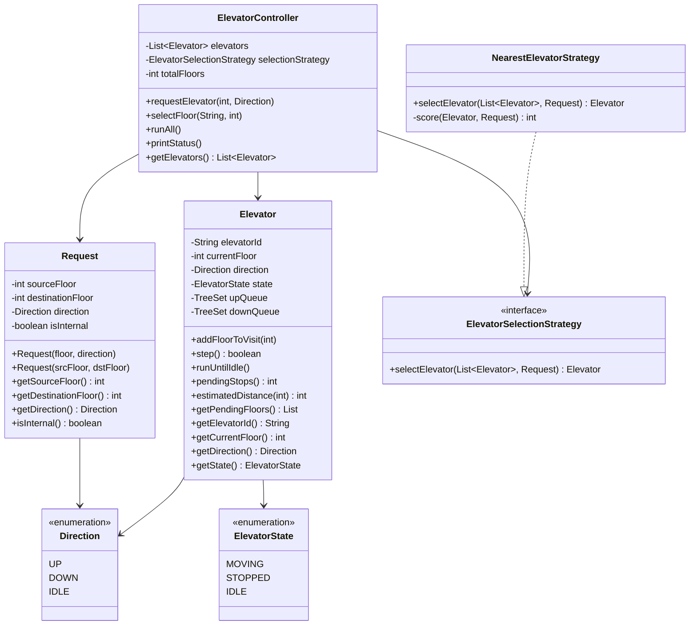

# 🛗 Elevator System — Low-Level Design

A complete **Java** implementation of an Elevator System following **SOLID principles** and the **Strategy design pattern**.

---

## 📐 Class Diagram (ASCII)

```
┌─────────────────────────────────────────────────────────────────────────┐
│                              ENUMS                                       │
│                                                                          │
│  ┌────────────────┐    ┌────────────────────┐    ┌──────────────────┐   │
│  │  «enum»        │    │  «enum»            │    │ «enum»           │   │
│  │  Direction     │    │  ElevatorState     │    │ (used internally)│   │
│  │────────────────│    │────────────────────│    └──────────────────┘   │
│  │  UP            │    │  MOVING            │                            │
│  │  DOWN          │    │  STOPPED           │                            │
│  │  IDLE          │    │  IDLE              │                            │
│  └────────────────┘    └────────────────────┘                            │
└─────────────────────────────────────────────────────────────────────────┘

┌────────────────────────────────────┐
│            Request                 │
│────────────────────────────────────│
│  -sourceFloor      : int           │
│  -destinationFloor : int           │  (-1 for external calls)
│  -direction        : Direction     │
│  -isInternal       : boolean       │
│────────────────────────────────────│
│  +Request(floor, direction)        │  ← external (floor panel)
│  +Request(srcFloor, dstFloor)      │  ← internal (cabin button)
│  +getSourceFloor()      : int      │
│  +getDestinationFloor() : int      │
│  +getDirection()        : Direction│
│  +isInternal()          : boolean  │
└────────────────────────────────────┘

┌─────────────────────────────────────────────────────────────────────┐
│                             Elevator                                 │
│─────────────────────────────────────────────────────────────────────│
│  -elevatorId   : String                                              │
│  -currentFloor : int                                                 │
│  -direction    : Direction                                           │
│  -state        : ElevatorState                                       │
│  -upQueue      : TreeSet<Integer>   (floors to visit going UP)       │
│  -downQueue    : TreeSet<Integer>   (floors to visit going DOWN)     │
│─────────────────────────────────────────────────────────────────────│
│  +addFloorToVisit(floor)                                             │
│  +step()              : boolean   (move one floor, return if moved)  │
│  +runUntilIdle()                  (run all pending steps)            │
│  +pendingStops()      : int                                          │
│  +estimatedDistance() : int                                          │
│  +getPendingFloors()  : List<Integer>                                │
│  +getElevatorId()     : String                                       │
│  +getCurrentFloor()   : int                                          │
│  +getDirection()      : Direction                                    │
│  +getState()          : ElevatorState                                │
└─────────────────────────────────────────────────────────────────────┘

┌──────────────────────────────────────────────────────────────────────┐
│                         STRATEGY PATTERN                              │
│                                                                       │
│  «interface»                                                          │
│  ElevatorSelectionStrategy                                            │
│  ─────────────────────────────────────────────────────               │
│  + selectElevator(List<Elevator>, Request) : Elevator                 │
│           ▲                                                           │
│           │ implements                                                │
│  NearestElevatorStrategy                                              │
│  ─────────────────────────────────────────────────────               │
│  + selectElevator(List<Elevator>, Request) : Elevator                 │
│    Score formula:                                                     │
│      • Same direction, on the way → score = distance                 │
│      • IDLE elevator              → score = distance + 5             │
│      • Moving away / opposite     → score = distance + 100 + load×2  │
└──────────────────────────────────────────────────────────────────────┘

┌──────────────────────────────────────────────────────────────────────┐
│                         ElevatorController                            │
│  ─────────────────────────────────────────────────────────────────── │
│  - elevators         : List<Elevator>                                 │
│  - selectionStrategy : ElevatorSelectionStrategy                      │
│  - totalFloors       : int                                            │
│  ─────────────────────────────────────────────────────────────────── │
│  + requestElevator(floor, direction)          ← external call         │
│  + selectFloor(elevatorId, destination)       ← internal call         │
│  + runAll()                                   ← run simulation        │
│  + printStatus()                              ← display state         │
│  + getElevators()   : List<Elevator>                                  │
└──────────────────────────────────────────────────────────────────────┘
```

---

## 📐 Mermaid Class Diagram



---

## 📦 Package Structure

```
ElevatorSystem/
├── Main.java                                    ← Entry point & demo
└── com/
    └── elevator/
        ├── model/
        │   ├── Direction.java                   ← Enum: UP, DOWN, IDLE
        │   ├── ElevatorState.java               ← Enum: MOVING, STOPPED, IDLE
        │   ├── Request.java                     ← External / internal request
        │   └── Elevator.java                    ← Cabin with SCAN scheduling
        ├── strategy/
        │   ├── ElevatorSelectionStrategy.java   ← Interface (Strategy pattern)
        │   └── NearestElevatorStrategy.java     ← Scored nearest-elevator impl
        └── service/
            └── ElevatorController.java          ← Central dispatcher
```

---

## 🎯 Design & Approach

### Design Patterns Used

| Pattern | Applied To | Purpose |
|---------|-----------|---------|
| **Strategy** | `ElevatorSelectionStrategy` | Swap elevator-dispatch algorithms (nearest, round-robin, etc.) without changing `ElevatorController` |
| **SCAN (Look)** | `Elevator` internal queues | Service all floors in current direction before reversing — minimises travel time |

### SOLID Principles

| Principle | How it's applied |
|-----------|-----------------|
| **S** — Single Responsibility | `Elevator` schedules its own internal moves; `ElevatorController` only dispatches; `Request` only models a call |
| **O** — Open/Closed | New dispatch strategies (e.g., `RoundRobinStrategy`) can be added by implementing `ElevatorSelectionStrategy` — no changes to `ElevatorController` |
| **L** — Liskov Substitution | `NearestElevatorStrategy` is a valid drop-in for any `ElevatorSelectionStrategy` reference |
| **I** — Interface Segregation | `ElevatorSelectionStrategy` has exactly one focused method |
| **D** — Dependency Inversion | `ElevatorController` depends on the `ElevatorSelectionStrategy` abstraction, injected at construction |

---

## 🔑 Key Design Decisions

### 1. SCAN / Look Algorithm (Internal Scheduling)
Each elevator maintains two sorted sets:
- **`upQueue`** — floors to visit while moving UP (ascending order).
- **`downQueue`** — floors to visit while moving DOWN (descending order).

When a floor is added:
- If it's above the current floor → added to `upQueue`.
- If it's below → added to `downQueue`.
- Elevator exhausts the current-direction queue before reversing.

This replicates a real elevator: it serves all requests in one direction before returning.

### 2. Dispatcher Scoring (External Requests)
`NearestElevatorStrategy` scores each elevator:

| Condition | Score |
|-----------|-------|
| Moving in **same direction**, **on the way** | `distance` |
| **IDLE** | `distance + 5` |
| Moving away / opposite direction | `distance + 100 + pending × 2` |

The elevator with the **lowest score wins**.

### 3. External vs Internal Requests
- **External** (`requestElevator`): pressed on a floor panel. The controller uses the strategy to dispatch an elevator to that floor.
- **Internal** (`selectFloor`): pressed inside a specific cabin. Routed directly to that elevator by ID.

---

## ⚙️ APIs

### `requestElevator(floor, direction)` — External Call
- Validates floor is within building range.
- Creates an external `Request`.
- Delegates to `ElevatorSelectionStrategy.selectElevator()`.
- Tells the chosen elevator to visit the requested floor.

### `selectFloor(elevatorId, destination)` — Internal Call
- Validates destination floor.
- Finds elevator by ID.
- Adds destination to the elevator's internal queue.

### `runAll()` — Simulation
- Iterates all elevators and runs each until IDLE.
- Prints floor-by-floor movement and door events.

### `printStatus()` — Snapshot
- Prints each elevator's current floor, direction, state, and pending stops.

---

## 🚀 How to Run

### Compile
```bash
cd ElevatorSystem
javac -d out com/elevator/model/*.java com/elevator/strategy/*.java com/elevator/service/*.java Main.java
```

### Run
```bash
java -cp out Main
```

### Sample Output (abridged)
```
╔══════════════════════════════════════════════╗
║        ELEVATOR SYSTEM — LLD DEMO            ║
╚══════════════════════════════════════════════╝

──────────────── Elevator Status ─────────────────
  Building: 10 floors | 2 elevators
  E1   │ Floor: 0   │ Dir: IDLE  │ State: IDLE     │ Pending: none
  E2   │ Floor: 0   │ Dir: IDLE  │ State: IDLE     │ Pending: none
───────────────────────────────────────────────────

▶  SCENARIO 1 — External Floor Requests

External request: Floor 3 [UP]
  → Dispatching E1 to floor 3
External request: Floor 7 [DOWN]
  → Dispatching E2 to floor 7
External request: Floor 1 [UP]
  → Dispatching E1 to floor 1

═══════════════════════════════════════════
  SIMULATION START
═══════════════════════════════════════════
  [E1] Starting from floor 0, direction=UP
  [E1] ▲ Reached floor 1 — Doors OPEN
  [E1] ▲ Reached floor 3 — Doors OPEN
  [E1] All requests served. Now IDLE at floor 3.

  [E2] Starting from floor 0, direction=UP
  [E2] ▲ Reached floor 7 — Doors OPEN
  [E2] All requests served. Now IDLE at floor 7.
═══════════════════════════════════════════
  SIMULATION COMPLETE
═══════════════════════════════════════════
```

---

## 🗺️ Flow Diagram

```
Person presses floor button (external)
          │
          ▼
  ElevatorController.requestElevator(floor, direction)
          │
          ├── Validate floor in range
          │
          ├── ElevatorSelectionStrategy.selectElevator()
          │         └── Score each elevator
          │               • Same direction + on-way → distance
          │               • IDLE                   → distance + 5
          │               • Moving away            → distance + 100 + load×2
          │
          ├── Elevator.addFloorToVisit(floor)
          │         └── Insert into upQueue or downQueue
          │
          └── Elevator.runUntilIdle()  [in simulation]
                    └── step() × N
                          └── SCAN: service upQueue ↑ then downQueue ↓


Person presses cabin button (internal)
          │
          ▼
  ElevatorController.selectFloor(elevatorId, destination)
          │
          ├── Find elevator by ID
          │
          └── Elevator.addFloorToVisit(destination)
```
