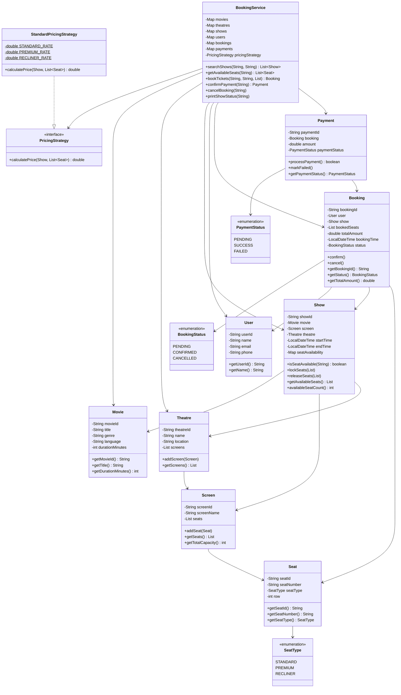

# 🎬 Movie Ticket Booking System — Low-Level Design

A complete **Java** implementation of a Movie Ticket Booking System following **SOLID principles** and the **Strategy design pattern**.

---

## 📐 Class Diagram (ASCII)

```
┌────────────────────────────────────────────────────────────────────────────┐
│                                 ENUMS                                       │
│                                                                             │
│  ┌──────────────┐    ┌──────────────────┐    ┌──────────────────┐          │
│  │  «enum»      │    │  «enum»          │    │  «enum»          │          │
│  │  SeatType    │    │  BookingStatus   │    │  PaymentStatus   │          │
│  │──────────────│    │──────────────────│    │──────────────────│          │
│  │  STANDARD    │    │  PENDING         │    │  PENDING         │          │
│  │  PREMIUM     │    │  CONFIRMED       │    │  SUCCESS         │          │
│  │  RECLINER    │    │  CANCELLED       │    │  FAILED          │          │
│  └──────────────┘    └──────────────────┘    └──────────────────┘          │
└────────────────────────────────────────────────────────────────────────────┘

┌──────────────────────┐       ┌───────────────────────────────────────────┐
│        Movie         │       │                   Show                     │
│──────────────────────│       │───────────────────────────────────────────│
│ -movieId: String     │       │ -showId: String                            │
│ -title: String       │◄──────│ -movie: Movie                              │
│ -genre: String       │       │ -screen: Screen                            │
│ -language: String    │       │ -theatre: Theatre                          │
│ -durationMinutes: int│       │ -startTime: LocalDateTime                  │
│──────────────────────│       │ -endTime: LocalDateTime                    │
│ +getMovieId()        │       │ -seatAvailability: Map<String, Boolean>    │
│ +getTitle()          │       │───────────────────────────────────────────│
│ +getDuration()       │       │ +isSeatAvailable(seatId): boolean          │
└──────────────────────┘       │ +lockSeats(seats)                          │
                               │ +releaseSeats(seats)                       │
┌──────────────────────┐       │ +getAvailableSeats(): List<Seat>           │
│        User          │       │ +availableSeatCount(): int                 │
│──────────────────────│       └───────────────────────────────────────────┘
│ -userId: String      │
│ -name: String        │       ┌──────────────────────────────────────────┐
│ -email: String       │       │                  Screen                   │
│ -phone: String       │       │──────────────────────────────────────────│
│──────────────────────│       │ -screenId: String                         │
│ +getUserId()         │       │ -screenName: String                       │
│ +getName()           │       │ -seats: List<Seat>                        │
└──────────────────────┘       │──────────────────────────────────────────│
                               │ +addSeat(seat)                            │
┌──────────────────────┐       │ +getSeats(): List<Seat>                   │
│       Theatre        │       │ +getTotalCapacity(): int                  │
│──────────────────────│       └──────────────────────────────────────────┘
│ -theatreId: String   │
│ -name: String        │       ┌──────────────────────────────────────────┐
│ -location: String    │       │                   Seat                    │
│ -screens: List<Screen│       │──────────────────────────────────────────│
│──────────────────────│       │ -seatId: String                           │
│ +addScreen(screen)   │       │ -seatNumber: String                       │
│ +getScreens()        │       │ -seatType: SeatType                       │
└──────────────────────┘       │ -row: int                                 │
                               │──────────────────────────────────────────│
                               │ +getSeatId(): String                      │
                               │ +getSeatNumber(): String                  │
                               │ +getSeatType(): SeatType                  │
                               └──────────────────────────────────────────┘

┌──────────────────────────────────────────────────────────────────────────┐
│                               Booking                                     │
│──────────────────────────────────────────────────────────────────────────│
│ -bookingId: String                                                        │
│ -user: User                                                               │
│ -show: Show                                                               │
│ -bookedSeats: List<Seat>                                                  │
│ -totalAmount: double                                                      │
│ -bookingTime: LocalDateTime                                               │
│ -status: BookingStatus                     PENDING → CONFIRMED            │
│──────────────────────────────────────────────────────────────────────────│     PENDING → CANCELLED
│ +confirm()                                                                │
│ +cancel()                                                                 │
│ +getBookingId(), getStatus(), getTotalAmount() ...                        │
└──────────────────────────────────────────────────────────────────────────┘

┌──────────────────────────────────────────────────────────────────────────┐
│                               Payment                                     │
│──────────────────────────────────────────────────────────────────────────│
│ -paymentId: String                                                        │
│ -booking: Booking                                                         │
│ -amount: double                                                           │
│ -paymentTime: LocalDateTime                                               │
│ -paymentStatus: PaymentStatus                                             │
│──────────────────────────────────────────────────────────────────────────│
│ +processPayment(): boolean                                                │
│ +markFailed()                                                             │
│ +getPaymentStatus(): PaymentStatus                                        │
└──────────────────────────────────────────────────────────────────────────┘

┌──────────────────────────────────────────────────────────────────────────┐
│                         STRATEGY PATTERN                                  │
│                                                                           │
│  «interface»                                                              │
│  PricingStrategy                                                          │
│  ──────────────────────────────────────────────────────────              │
│  + calculatePrice(Show, List<Seat>) : double                              │
│           ▲                                                               │
│           │ implements                                                    │
│  StandardPricingStrategy                                                  │
│  ──────────────────────────────────────────────────────────              │
│  - STANDARD_RATE  = ₹150 / seat                                          │
│  - PREMIUM_RATE   = ₹250 / seat                                          │
│  - RECLINER_RATE  = ₹400 / seat                                          │
│  + calculatePrice(Show, List<Seat>) : double                              │
└──────────────────────────────────────────────────────────────────────────┘

┌──────────────────────────────────────────────────────────────────────────┐
│                           BookingService                                  │
│  ─────────────────────────────────────────────────────────────────────── │
│  - movies   : Map<String, Movie>                                          │
│  - theatres : Map<String, Theatre>                                        │
│  - shows    : Map<String, Show>                                           │
│  - users    : Map<String, User>                                           │
│  - bookings : Map<String, Booking>                                        │
│  - payments : Map<String, Payment>                                        │
│  - pricingStrategy : PricingStrategy                                      │
│  ─────────────────────────────────────────────────────────────────────── │
│  + searchShows(movieTitle, location)   : List<Show>                       │
│  + getAvailableSeats(showId)           : List<Seat>                       │
│  + bookTickets(userId, showId, seats)  : Booking          [PENDING]       │
│  + confirmPayment(bookingId)           : Payment          [CONFIRMED]     │
│  + cancelBooking(bookingId)                               [CANCELLED]     │
│  + getBooking(bookingId)               : Booking                          │
│  + printShowStatus(showId)                                                │
└──────────────────────────────────────────────────────────────────────────┘
```

---

## 📐 Mermaid Class Diagram



---

## 📦 Package Structure

```
MovieTicketBooking/
├── Main.java                                         ← Entry point & 4 demo scenarios
└── com/
    └── moviebooking/
        ├── model/
        │   ├── SeatType.java                         ← Enum: STANDARD, PREMIUM, RECLINER
        │   ├── BookingStatus.java                    ← Enum: PENDING, CONFIRMED, CANCELLED
        │   ├── PaymentStatus.java                    ← Enum: PENDING, SUCCESS, FAILED
        │   ├── Movie.java                            ← Movie catalogue entry
        │   ├── User.java                             ← Registered customer
        │   ├── Seat.java                             ← Physical seat in a screen
        │   ├── Screen.java                           ← Cinema screen with seat layout
        │   ├── Theatre.java                          ← Multiplex with screens
        │   ├── Show.java                             ← Screening with per-show seat map
        │   ├── Booking.java                          ← Ticket booking (PENDING→CONFIRMED)
        │   └── Payment.java                          ← Payment transaction
        ├── strategy/
        │   ├── PricingStrategy.java                  ← Interface (Strategy pattern)
        │   └── StandardPricingStrategy.java          ← Fixed per-SeatType rates
        └── service/
            └── BookingService.java                   ← Core booking APIs
```

---

## 🎯 Design & Approach

### Design Patterns Used

| Pattern | Applied To | Purpose |
|---------|-----------|---------|
| **Strategy** | `PricingStrategy` | Swap pricing algorithms (standard, dynamic, discount) without changing `BookingService` |

### SOLID Principles

| Principle | How it's applied |
|-----------|-----------------|
| **S** — Single Responsibility | `Show` manages seat availability; `BookingService` orchestrates APIs; `Payment` handles transactions |
| **O** — Open/Closed | New pricing strategies (e.g., `WeekendSurgePricingStrategy`) only require implementing `PricingStrategy` — no changes to `BookingService` |
| **L** — Liskov Substitution | `StandardPricingStrategy` is a valid substitute wherever `PricingStrategy` is expected |
| **I** — Interface Segregation | `PricingStrategy` is a minimal single-method interface |
| **D** — Dependency Inversion | `BookingService` depends on the `PricingStrategy` abstraction, injected at construction |

---

## 🔑 Key Design Decisions

### 1. Per-Show Seat Availability (not per-Seat)
Seat availability is tracked in `Show.seatAvailability : Map<String, Boolean>` — a map of `seatId → available`.
This means the same `Seat` and `Screen` objects are reused across multiple shows with zero interference.

### 2. Two-Phase Booking (PENDING → CONFIRMED)
```
bookTickets()      →  locks seats, creates Booking [PENDING]
confirmPayment()   →  processes payment → Booking [CONFIRMED]
cancelBooking()    →  releases seats   → Booking [CANCELLED]
```
If payment fails, seats are automatically released so other users can book them.

### 3. Seat Rates

| SeatType | Rate per seat |
|----------|--------------|
| STANDARD | ₹150 |
| PREMIUM  | ₹250 |
| RECLINER | ₹400 |

### 4. Conflict Detection
`Show.lockSeats()` throws `IllegalStateException` if any requested seat is already booked, providing basic concurrency safety in a single-threaded context.

---

## ⚙️ APIs

### `searchShows(movieTitle, location) → List<Show>`
- Case-insensitive partial match on movie title and theatre location.
- Returns only shows with at least one available seat.

### `getAvailableSeats(showId) → List<Seat>`
- Returns all seats not yet locked for the given show.

### `bookTickets(userId, showId, seatIds) → Booking`
- Validates user and show exist.
- Resolves seat IDs → Seat objects.
- Calls `show.lockSeats()` (throws if conflict).
- Computes price via `PricingStrategy`.
- Returns a `PENDING` Booking.

### `confirmPayment(bookingId) → Payment`
- Validates booking is PENDING.
- Creates and processes a `Payment`.
- On success → `Booking.confirm()`.
- On failure → `Booking.cancel()` + `show.releaseSeats()`.

### `cancelBooking(bookingId)`
- Validates booking is not already CANCELLED.
- Calls `Booking.cancel()` + `show.releaseSeats()`.

### `printShowStatus(showId)`
- Prints count of available seats per SeatType.

---

## 🚀 How to Run

### Compile
```bash
cd MovieTicketBooking
javac -d out com/moviebooking/model/*.java com/moviebooking/strategy/*.java com/moviebooking/service/*.java Main.java
```

### Run
```bash
java -cp out Main
```

### Sample Output (abridged)
```
╔══════════════════════════════════════════════════╗
║    MOVIE TICKET BOOKING SYSTEM — LLD DEMO        ║
╚══════════════════════════════════════════════════╝

▶  SCENARIO 1 — Alice books 2 STANDARD + 1 PREMIUM seat for Dune

  Search: 'Dune' in 'Bangalore'
    Found: Show{id='SH01', movie='Dune: Part Two', ...}
    Found: Show{id='SH03', movie='Dune: Part Two', ...}

  Available seats for SH01:
  Show [SH01] — Dune: Part Two @ 2026-04-01T10:00
    STANDARD   : 10 available
    PREMIUM    : 5 available
    RECLINER   : 0 available

  Alice selects seats A1, A2 (STANDARD) and C1 (PREMIUM):
  ✅ Booking created: BK0001 | Seats: [...] | Amount: ₹550.00 | Status: PENDING

  Processing payment:
  💳 Payment PAY0001 succeeded → Booking BK0001 CONFIRMED

▶  SCENARIO 4 — Conflict: Bob tries to book A3 already taken
  ⚠ Seat A3 is already booked for show SH01
```

---

## 🗺️ Flow Diagram

```
Customer searches for a movie
          │
          ▼
BookingService.searchShows(title, location)
          │
          └── Filters shows by title, location, availability > 0

Customer selects seats
          │
          ▼
BookingService.bookTickets(userId, showId, seatIds)
          │
          ├── Validate user & show
          ├── Resolve seatIds → Seat objects
          ├── Show.lockSeats()
          │     └── Throws if any seat already taken
          ├── PricingStrategy.calculatePrice()
          └── Return Booking [PENDING]

Customer pays
          │
          ▼
BookingService.confirmPayment(bookingId)
          │
          ├── Create Payment
          ├── Payment.processPayment()
          │     ├── SUCCESS → Booking.confirm() [CONFIRMED]
          │     └── FAILURE → Booking.cancel() + show.releaseSeats() [CANCELLED]
          └── Return Payment

Customer cancels
          │
          ▼
BookingService.cancelBooking(bookingId)
          │
          ├── Booking.cancel()
          └── show.releaseSeats() — seats freed for others
```
