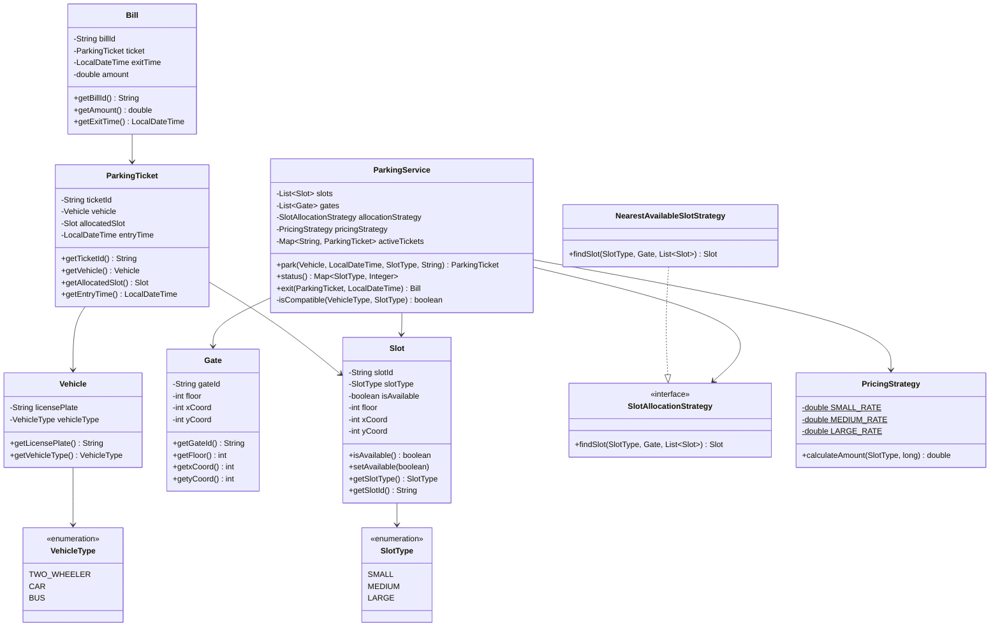

# 🏢 Multilevel Parking Lot — Low-Level Design

A complete **Java** implementation of a Multilevel Parking Lot system following SOLID principles and the Strategy design pattern.

---

## 📐 Class Diagram

```
┌─────────────────────────────────────────────────────────────────────────┐
│                         ENUMS                                           │
│                                                                         │
│  ┌───────────────┐          ┌─────────────────┐                        │
│  │  «enum»       │          │  «enum»          │                        │
│  │  SlotType     │          │  VehicleType     │                        │
│  │───────────────│          │─────────────────│                        │
│  │ SMALL         │          │ TWO_WHEELER      │                        │
│  │ MEDIUM        │          │ CAR              │                        │
│  │ LARGE         │          │ BUS              │                        │
│  └───────────────┘          └─────────────────┘                        │
└─────────────────────────────────────────────────────────────────────────┘

┌─────────────┐         ┌──────────────────────┐       ┌──────────────┐
│   Vehicle   │         │    ParkingTicket      │       │     Gate     │
│─────────────│         │──────────────────────│       │──────────────│
│-licensePlate│         │-ticketId: String      │       │-gateId       │
│-vehicleType │◄────────│-vehicle: Vehicle      │       │-floor        │
│─────────────│         │-allocatedSlot: Slot   │       │-xCoord       │
│+getLicense()│         │-entryTime: LocalDT    │       │-yCoord       │
│+getVehicle()│         │──────────────────────│       │──────────────│
│             │         │+getTicketId()         │       │+getGateId()  │
└─────────────┘         │+getVehicle()          │       │+getFloor()   │
                        │+getAllocatedSlot()    │       │+getxCoord()  │
                        │+getEntryTime()        │       │+getyCoord()  │
                        └──────────┬────────────┘       └──────────────┘
                                   │ contains
                                   ▼
                           ┌──────────────┐
                           │     Slot     │
                           │──────────────│
                           │-slotId       │
                           │-slotType     │
                           │-isAvailable  │
                           │-floor        │
                           │-xCoord       │
                           │-yCoord       │
                           │──────────────│
                           │+isAvailable()│
                           │+setAvailable │
                           │+getSlotType()│
                           └──────────────┘

┌─────────────┐
│    Bill     │
│─────────────│
│-billId      │
│-ticket      │◄──────── contains ParkingTicket
│-exitTime    │
│-amount      │
│─────────────│
│+getBillId() │
│+getAmount() │
└─────────────┘

┌──────────────────────────────────────────────────────────────────────┐
│                        STRATEGY PATTERN                               │
│                                                                       │
│  «interface»                                                          │
│  SlotAllocationStrategy                                               │
│  ─────────────────────────────                                        │
│  + findSlot(SlotType, Gate, List<Slot>): Slot                        │
│           ▲                                                           │
│           │ implements                                                │
│  NearestAvailableSlotStrategy                                        │
│  ─────────────────────────────                                        │
│  + findSlot(SlotType, Gate, List<Slot>): Slot                        │
│    (Manhattan distance calculation)                                   │
│                                                                       │
│  PricingStrategy                                                      │
│  ─────────────────────────────                                        │
│  - SMALL_RATE  = 20.0/hr                                              │
│  - MEDIUM_RATE = 50.0/hr                                              │
│  - LARGE_RATE  = 100.0/hr                                             │
│  + calculateAmount(SlotType, durationInSeconds): double               │
└──────────────────────────────────────────────────────────────────────┘

┌──────────────────────────────────────────────────────────────────────┐
│                          ParkingService                               │
│  ─────────────────────────────────────────────────────────────────── │
│  - slots: List<Slot>                                                  │
│  - gates: List<Gate>                                                  │
│  - allocationStrategy: SlotAllocationStrategy                         │
│  - pricingStrategy: PricingStrategy                                   │
│  - activeTickets: Map<String, ParkingTicket>                          │
│  ─────────────────────────────────────────────────────────────────── │
│  + park(Vehicle, LocalDateTime, SlotType, String): ParkingTicket     │
│  + status(): Map<SlotType, Integer>                                   │
│  + exit(ParkingTicket, LocalDateTime): Bill                           │
│  - isCompatible(VehicleType, SlotType): boolean                       │
└──────────────────────────────────────────────────────────────────────┘
```

### Mermaid Class Diagram



---

## 📦 Package Structure

```
ParkingLot/
└── com/
    └── parkinglot/
        ├── Main.java                          ← Entry point & demo
        ├── model/
        │   ├── Vehicle.java                   ← Vehicle entity
        │   ├── VehicleType.java               ← Enum: TWO_WHEELER, CAR, BUS
        │   ├── Slot.java                      ← Parking slot entity
        │   ├── SlotType.java                  ← Enum: SMALL, MEDIUM, LARGE
        │   ├── Gate.java                      ← Entry/exit gate entity
        │   ├── ParkingTicket.java             ← Ticket issued at entry
        │   └── Bill.java                      ← Bill generated at exit
        ├── service/
        │   └── ParkingService.java            ← Core APIs: park, status, exit
        └── strategy/
            ├── SlotAllocationStrategy.java    ← Interface (Strategy pattern)
            ├── NearestAvailableSlotStrategy.java ← Nearest-slot implementation
            └── PricingStrategy.java           ← Hourly rate billing
```

---

## 🎯 Design & Approach

### Design Patterns Used

| Pattern | Applied To | Purpose |
|---------|-----------|---------|
| **Strategy** | `SlotAllocationStrategy` | Swap slot-finding algorithms without modifying core service |
| **Strategy** | `PricingStrategy` | Decouple billing logic from service orchestration |

### SOLID Principles

- **S — Single Responsibility**: Each class has one clear job (e.g., `Bill` only holds billing data; `ParkingService` only orchestrates APIs).
- **O — Open/Closed**: New slot-finding strategies (e.g., `RandomSlotStrategy`) can be added by implementing `SlotAllocationStrategy` without changing `ParkingService`.
- **L — Liskov Substitution**: `NearestAvailableSlotStrategy` is a valid substitute wherever `SlotAllocationStrategy` is expected.
- **I — Interface Segregation**: `SlotAllocationStrategy` is a minimal, focused interface with a single method.
- **D — Dependency Inversion**: `ParkingService` depends on the abstract `SlotAllocationStrategy` interface, not a concrete class.

---

## 🔑 Key Design Decisions

### 1. Slot Compatibility Rules
Encoded inside `ParkingService.isCompatible()`:

| Vehicle Type | Compatible Slots |
|-------------|-----------------|
| TWO_WHEELER (2-wheeler) | SMALL, MEDIUM, LARGE |
| CAR | MEDIUM, LARGE |
| BUS | LARGE only |

### 2. Nearest Slot — Manhattan Distance
The `NearestAvailableSlotStrategy` uses **Manhattan distance** across floor, X, and Y coordinates:

```
distance = |slot.floor - gate.floor| × 10
         + |slot.xCoord - gate.xCoord|
         + |slot.yCoord - gate.yCoord|
```

Floor differences are weighted (×10) to account for the cost of changing floors.

### 3. Billing Based on Slot Type (Not Vehicle Type)
If a 2-wheeler parks in a MEDIUM slot, it is billed at the **MEDIUM rate**.  
Billing is computed as: `ceil(durationInSeconds / 3600) × hourlyRate`, with a minimum charge of 1 hour.

### 4. Hourly Rates

| Slot Type | Rate (per hour) |
|-----------|----------------|
| SMALL | ₹20 |
| MEDIUM | ₹50 |
| LARGE | ₹100 |

---

## ⚙️ APIs

### `park(vehicle, entryTime, requestedSlotType, entryGateID) → ParkingTicket`
- Validates vehicle-slot compatibility
- Finds the nearest available slot via the strategy
- Marks the slot as **occupied**
- Returns a `ParkingTicket` with vehicle, slot, and entry time

### `status() → Map<SlotType, Integer>`
- Returns the count of **available** slots per type
- Example: `{SMALL=2, MEDIUM=1, LARGE=0}`

### `exit(parkingTicket, exitTime) → Bill`
- Validates the ticket
- Calculates duration since entry
- Delegates to `PricingStrategy` for billing (charged by **slot type**)
- Frees the slot back to available
- Returns a `Bill` with amount and exit time

---

## 🚀 How to Run

### Compile
```bash
cd ParkingLot
javac -d out com/parkinglot/model/*.java com/parkinglot/strategy/*.java com/parkinglot/service/*.java com/parkinglot/*.java
```

### Run
```bash
java -cp out com.parkinglot.Main
```

### Sample Output
```
--- Initial Parking Lot Status ---
SMALL: 2 available
MEDIUM: 1 available
LARGE: 1 available

--- Park a 2-Wheeler in SMALL slot via Gate-1 ---
Parked Vehicle: BH-1111 at Slot: S1

--- Park a 2-Wheeler in MEDIUM slot via Gate-2 ---
Parked Vehicle: BH-2222 at Slot: M1

--- Parking Lot Status After Entries ---
SMALL: 1 available
MEDIUM: 0 available
LARGE: 1 available

--- Exit Vehicle BH-1111 ---
Bill Amount for SMALL slot (approx 2 hrs): 40.0

--- Exit Vehicle BH-2222 ---
Bill Amount for MEDIUM slot (approx 1 hr): 50.0

--- Parking Lot Status After Exits ---
SMALL: 2 available
MEDIUM: 1 available
LARGE: 1 available
```

---

## 🗺️ Flow Diagram

```
Vehicle Arrives
      │
      ▼
park(vehicle, entryTime, slotType, gateID)
      │
      ├── Validate compatibility (VehicleType ↔ SlotType)
      │
      ├── Locate Gate by gateID
      │
      ├── NearestAvailableSlotStrategy.findSlot()
      │         └── Manhattan distance across all available matching slots
      │
      ├── Mark slot as OCCUPIED
      │
      └── Return ParkingTicket (ticketId, vehicle, slot, entryTime)


Vehicle Exits
      │
      ▼
exit(parkingTicket, exitTime)
      │
      ├── Validate ticket (active, not duplicate)
      │
      ├── Compute duration = exitTime - entryTime
      │
      ├── PricingStrategy.calculateAmount(slotType, duration)
      │         └── ceil(hours) × rate[slotType]
      │
      ├── Mark slot as AVAILABLE
      │
      └── Return Bill (billId, amount, exitTime)
```
